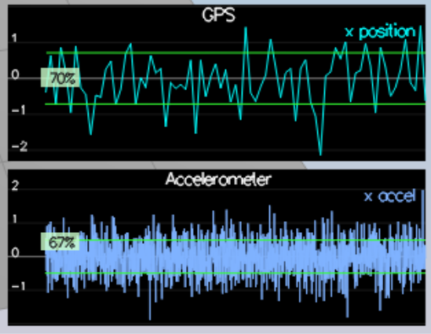
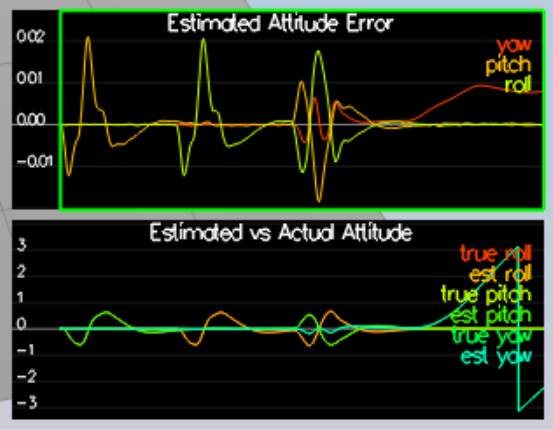
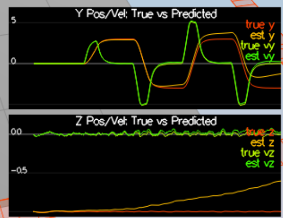
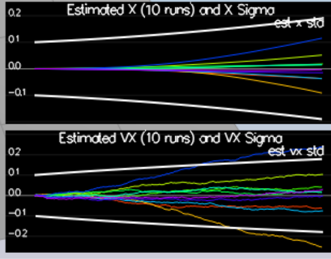
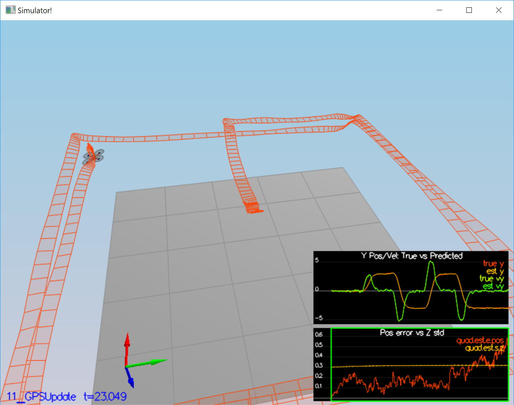
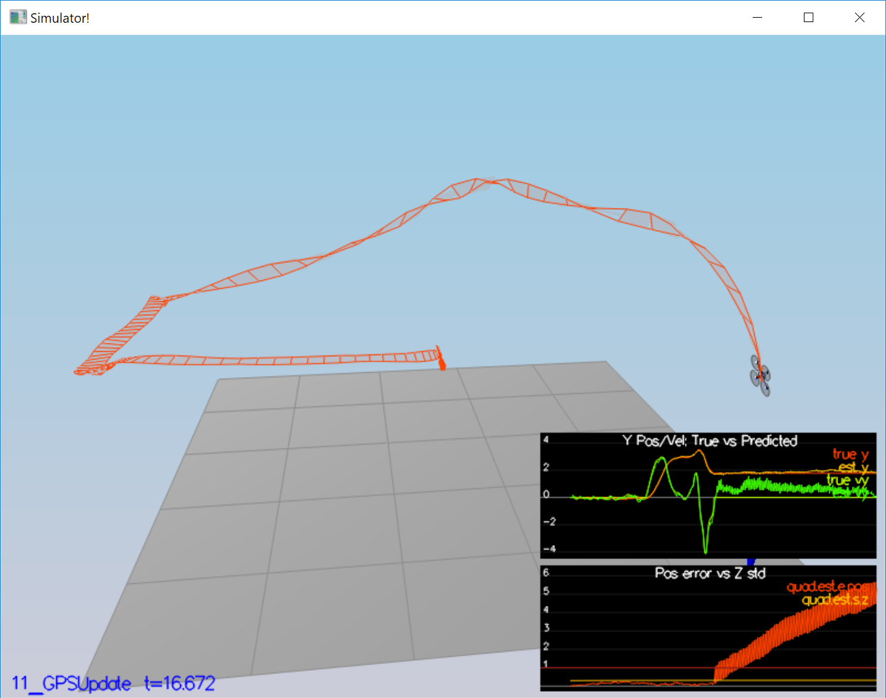
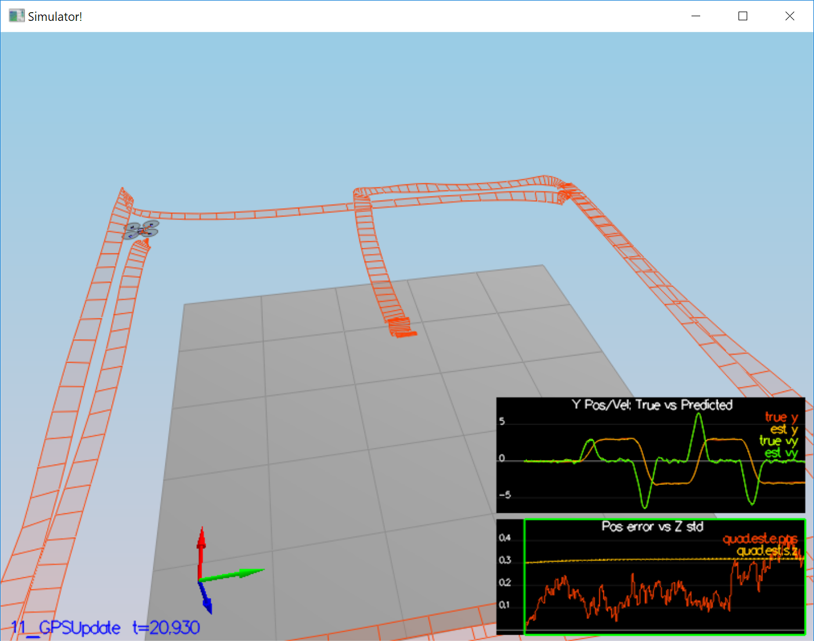

# Estimation Project #

This is my solution to the Estimation Project.

This README is broken down into the following sections:

 - [Setup](#setup) - the environment and code setup required to get started and a brief overview of the project structure
 - [The Tasks](#the-tasks) - the tasks you will need to complete for the project

## Setup ##

The github repository was forked and then cloned to my workstation. It build properly using Visual Studio 2019. I did find that
VIsual Studio 2019 found a few more warnings in the code than VS 2017 did. But the build succeeded.

## The Tasks ##

Once again, you will be building up your estimator in pieces.  At each step, there will be a set of success criteria that will be displayed both in the plots and in the terminal output to help you along the way.

Project outline:

 - [Step 1: Sensor Noise](#step-1-sensor-noise)
 - [Step 2: Attitude Estimation](#step-2-attitude-estimation)
 - [Step 3: Prediction Step](#step-3-prediction-step)
 - [Step 4: Magnetometer Update](#step-4-magnetometer-update)
 - [Step 5: Closed Loop + GPS Update](#step-5-closed-loop--gps-update)
 - [Step 6: Adding Your Controller](#step-6-adding-your-controller)

### Step 1: Sensor Noise ###

 - The simulator was built with the unmodified code and Scenario 06_NoisySensors was chosen. 
 - A Python script was created to read `config/log/Graph1.txt` and `config/log/Graph2.txt` and process the data to find the mean and standard deviation for the two sensors.
 - The script is in the file `scripts/SensorNoise.py`.
 - The script used numpy.mean and numpy.std to capture the mean and standard deviation.
 - The new values for standard deviation were added to `config/06_Sensornoise.txt`, `MeasuredStdDev_GPSPosXY` and `MeasuredStdDev_AccelXY`.
 - The simulator was run and the test passed.
 - The computed values were checked against the values in  `SimulatedSensors.txt` and they were close. The computed values had a few more digits of precision.

  

### Step 2: Attitude Estimation ###

 - Scenario `07_Attitude Estimation` was run
 - The  `UpdateFromIMU()`  function was modified per the instructions to add a better integration process.
 - The Quaternion method was used, with function `FromEuler123_RPY` , `IntegrateBodyRate` and `ToEulerRPY`.
 - The yaw component was limited to += PI
 - The simulator was run and the test passed. 

  

### Step 3: Prediction Step ###

 - Scenario `08_PredictState` was run.
 - The `PredictState()` function was modified per the instructions.
 - The Euler derivatives and linear accelerations were computed, and then integrated to be velocity and position.
 - The state vector was updated
 - The simulator was run with the following result:

 

 - Scenario `09_PredictionCov' was run
 - The `GetRbgPrime` function was updated to compute the partial derivatives. Referenced the `Estimation for Quadrotors` paper for this step.
 - the `Predict()` function was updated to compute the covariance.
 - The  `QPosXYStd` and `QVelXYStd` process parameters were tuned to attempt to capture the error magnitude. 

 

### Step 4: Magnetometer Update ###

Up until now we've only used the accelerometer and gyro for our state estimation.  In this step, you will be adding the information from the magnetometer to improve your filter's performance in estimating the vehicle's heading.

 - Scenario  `10_MagUpdate` was run. 
 - The parameter  `QYawStd` was tuned to where it looked like it was following the drift.
 - The `UpdateFromMag()` function was modified to produce the proper parameters that where forwarded to `Update`.
 - Scenario  `10_MagUpdate` was run again and the test passed. 

 

Note : At first I was attempting to implement the full 'update' step for the yaw controller with the matrix multiplications and such. However
I could not figure out what was required to account for roll and pitch to correct the mag heading term, since the lesson video
referred to it but did not cover the required mat.. Then 'facepalm' I realized the 
yaw parameter input to the function was already processed, and further, the function only needed to set up its output parameters properly
and the 'Update' function was peforming the actual 'update' step.

### Step 5: Closed Loop + GPS Update ###

 - Scenario  `11_GPSUpdate` was run. 
 -  `Quad.UseIdealEstimator` was set to 0.
 -  The two lines in `config/11_GPSUpdate.txt` were commented out according to the instructions.
 -  The process noise models were tuned.
 -  The function `UpdateFromGPS()` was implemented.
 - Scenario  `11_GPSUpdate` was rerun and the test passed.

 

 

### Step 6: Adding Your Controller ###

 - The files `QuadController.cpp` and `QuadControlParams.txt` were replaced with the versions from my implementation from the controller project.
 - Scenario `11_GPSUpdate` was run.
 - After the second right turn, the drone began to spin and spriralled up and away to the right. Tuning the gains in `QuadControlParams.txt` did not fix the problem.
 - It appeared something was very wrong with Yaw, either in the estimator or controller code.

At this point I used the Visual Studio Debugger to attempt to figure out the problem. After a couple of hours of tuning and checking, I found that there was a bug in my
controller code. I had made a mistake in my attempt to limit the yaw parameters in the `QuadControl::YawControl` function. I had limited each term separately but
I did not limit the resulting yaw error term. I found it was exceeding += PI. I needed to normalize the yaw error rather than the separate input terms. I fixed this
(see comments in `QuadControl::YawControl`).  All the tests in the Controller project had passed, so apparently in those tests I was lucky that the yaw error
term did not exceed the missing limit.

 - The original gains in `QuadControlParams.txt` were restored.
 - Scenario `11_GPSUpdate` was run.
 - This time the initial problem no longer occurred, but the drone had a lot of overshoot as it tried to follow the path.
 - The gains were reduced by approximately 30%, per the instruction.
 - The scenario was run and the test passed.

### Conclusion

All tests passed with my implementation, with the controller code fixed. This project was challenging however it provided implementations of much of the estimator, which
made it a bit easier than it could have been. I saw that the code used the `Eigen` linear algebra library, which was good, because I had been wondering which of the
available LA libraries was a good choice. I found that the Eigen library was relatively easy to use, with the exception of slicing of matrices, which I couldn't figure
out from looking at the Eigen documentation.

### References
'Estimation For Quadrotors'
'Feasiblity of Motion Primitives for Choreographed Quadrocopter Flight'
'Feed-Forward Parameter Identification for Precise Periodic Quadrocopter Motions'

